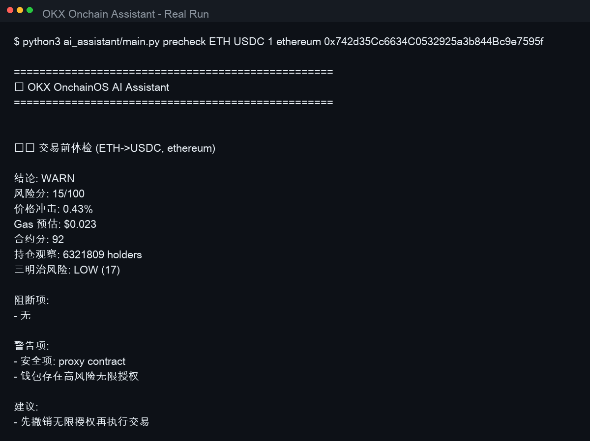
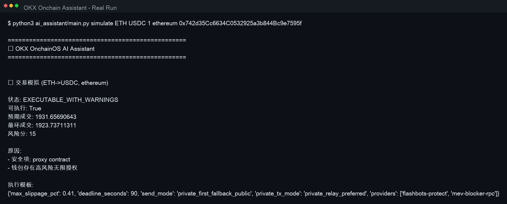
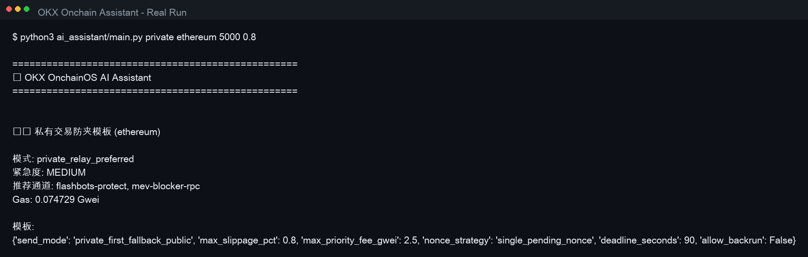
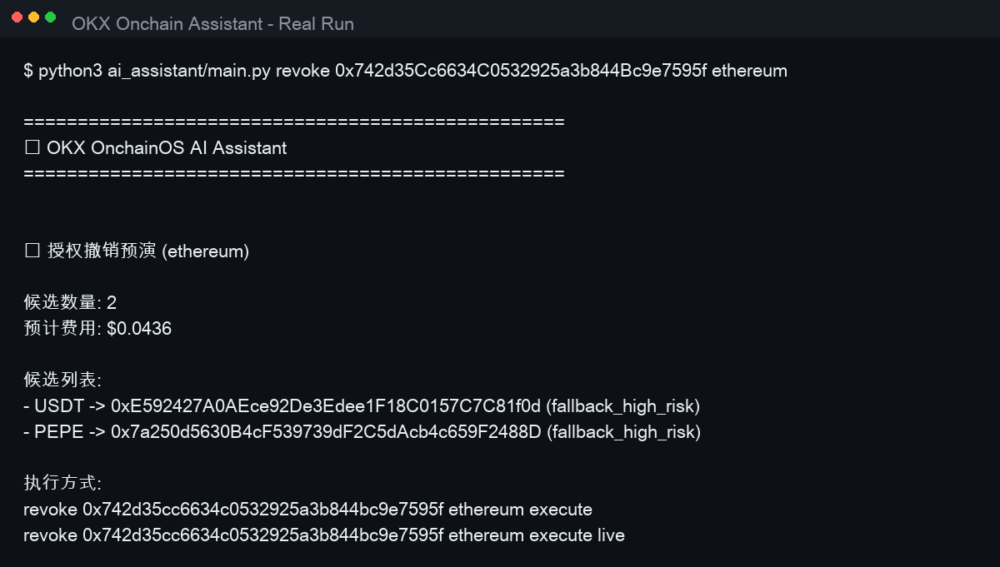
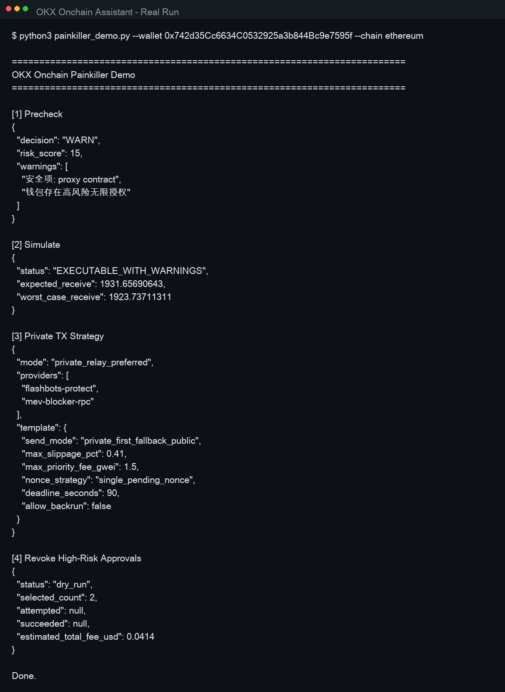

# OKX 参赛材料（提交版）

更新时间：2026-03-08

## 1) Claw 型号
- OpenClaw（本地兼容 OpenAI Chat Completions 接口）
- 接口地址：`OPENCLAW_API_URL`（默认 `http://127.0.0.1:8080`）

## 2) 大模型版本
- 默认模型：`anthropic/MiniMax-M2.5`
- 配置位置：
  - `okx_skills/onchainos_api.py` 的 `OPENCLAW_MODEL`
  - 支持通过环境变量覆盖：`OPENCLAW_MODEL=...`

## 3) 提示词（核心模板）
- 市场分析提示词（动态拼接链上数据）：
  - 基于价格、24h 涨跌、市值、Holder、Smart Money 流向，输出短期趋势、支撑阻力、风险提示、操作建议（2-3 句）。
- 交易计划提示词（动态拼接报价与 gas）：
  - 基于当前价格、预期成交、价格冲击、Gas、滑点建议，输出入场策略、止盈止损、风控要点。
- 通用问答：
  - 用户输入直接进入 `ask_ai(prompt)`，在无在线模型时使用本地 fallback 建议。

完整可复用模板见：
- [prompt_templates_cn.md](./prompt_templates_cn.md)

## 4) 应用场景
- 场景 A：高波动代币交易前体检（`precheck`）
  - 解决痛点：用户下单前无法快速量化风险，容易被高冲击/低安全资产误伤。
- 场景 B：交易可执行性预演（`simulate`）
  - 解决痛点：不知道“现在下单是否值得执行”，容易盲目成交。
- 场景 C：防夹路由模板（`private`）
  - 解决痛点：公开 mempool 下单易被夹子机器人盯上。
- 场景 D：高风险授权撤销（`revoke`）
  - 解决痛点：历史无限授权长期暴露钱包风险。

## 5) 成品互动真实截图
说明：以下截图均由真实命令执行结果生成，原始输出保存在 `submission_assets/raw_outputs/`。

### 5.1 交易前体检（precheck）


### 5.2 交易模拟（simulate）


### 5.3 私有交易策略（private）


### 5.4 授权撤销预演（revoke dry-run）


### 5.5 一键痛点方案演示（painkiller demo）


## 6) 复现命令
```bash
python3 ai_assistant/main.py precheck ETH USDC 1 ethereum 0x742d35Cc6634C0532925a3b844Bc9e7595f
python3 ai_assistant/main.py simulate ETH USDC 1 ethereum 0x742d35Cc6634C0532925a3b844Bc9e7595f
python3 ai_assistant/main.py private ethereum 5000 0.8
python3 ai_assistant/main.py revoke 0x742d35Cc6634C0532925a3b844Bc9e7595f ethereum
python3 painkiller_demo.py --wallet 0x742d35Cc6634C0532925a3b844Bc9e7595f --chain ethereum
```
